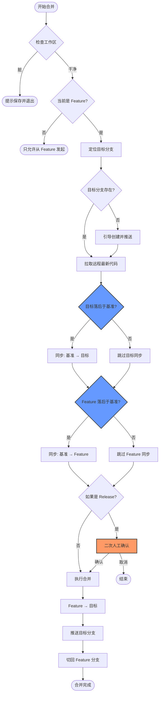

# 🚀 Auto-Git-Flow (agf)

[](https://www.npmjs.com/package/@sppk/auto-git-flow)

**Auto-Git-Flow** 是一个专为团队协作设计的 Git 工作流自动化工具。它通过命令行交互（CLI）规范化分支命名，并自动处理繁琐的合并流程，防止人为错误，提升交付效率。

---

## ✨ 核心特性

- 🛠 **命名规范化**: 自动生成符合团队约定的 `feat/`, `DEV-`, `RELEASE-` 分支名称。
- 🔄 **合并自动化**: 一键同步基准分支、合并代码并推送到远程，减少手工误操作。
- 🧠 **智能检测**: 自动检测分支落后状态，仅在必要时执行同步，避免冗余操作。
- 📋 **全景视图**: 快速查看当前项目的开发（Dev）与发布（Release）分支状态。
- 🛡 **安全检查**: 执行前自动检查工作区状态，确保代码提交安全。
- ⌨️ **交互式体验**: 基于 `@inquirer/prompts` 提供平滑的命令行交互。

---

## 📦 安装

### 全局安装 (推荐)

```bash
pnpm add -g @sppk/auto-git-flow
```

### 直接运行 (无需安装)

```bash
pnpx agf --help
```

---

## 🛠 常用命令

| 命令         | 说明                                                    | 用法                       |
| ------------ | ------------------------------------------------------- | -------------------------- |
| `agf list`   | 展示最近的开发分支与发布分支列表                        | `agf list [count]`         |
| `agf create` | 根据类型（Feature/Dev/Release）和需求号自动生成规范分支 | `agf create`               |
| `agf merge`  | 将当前 Feature 分支合并到指定的目标分支                 | `agf merge <dev\|release>` |
| `agf sync`   | 同步基准分支代码到当前 Feature 分支                     | `agf sync`                 |

### 命令详解

#### `agf list [count]`

查看最近的 Dev 与 Release 分支，默认显示最近 2 个。可用于检查 `agf` 识别的分支是否正确。

#### `agf create`

交互式创建分支，根据类型自动生成规范命名。

#### `agf merge <target>`

将当前 Feature 分支合并到目标分支（`dev` 或 `release`）。

**智能同步机制**：

- 自动检测目标分支是否落后于基准分支，仅在落后时执行同步
- 自动检测当前 Feature 分支是否落后于基准分支，必要时先同步 Feature

#### `agf sync`

手动同步基准分支（最新 Release）到当前 Feature 分支。如果当前分支已包含基准分支的所有提交，则跳过同步。

## 📋 命名规范

工具严格遵循以下命名约定：

- **Feature**: `feat/<username>-<date>-<reqNo>`  
  _示例: `feat/jack-20231024-QZ-8848`_
- **Dev**: `<project>-DEV-<date>`  
  _示例: `mall-DEV-20231024`_
- **Release**: `<project>-RELEASE-<date>`  
  _示例: `mall-RELEASE-20231024`_

## 📐 工作流图解

### 分支创建流程 (Create)

如果是 `dev` 或 `release` 分支，会自动推送到远程并切回原分支；如果是 `feature` 分支，则留在新分支。


### 分支合并流程 (Merge)

将当前特性分支合并到目标环境。会**智能检测**分支落后状态，仅在必要时执行同步。


