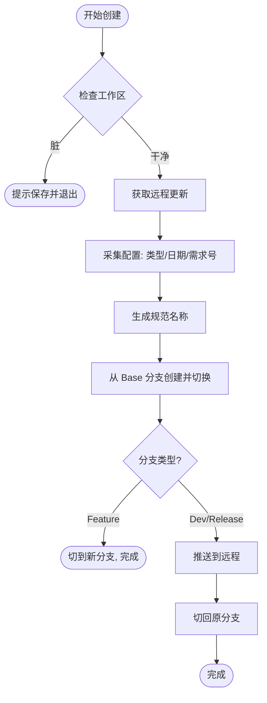
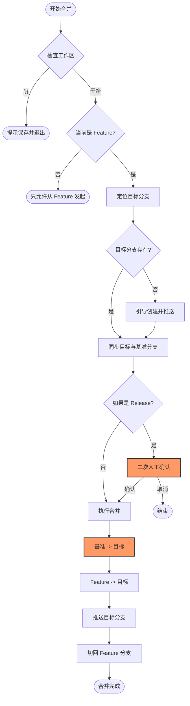

# 🚀 Auto-Git-Flow (agf)

[](https://www.npmjs.com/package/@sppk/auto-git-flow)

**Auto-Git-Flow** 是一个专为团队协作设计的 Git 工作流自动化工具。它通过命令行交互（CLI）规范化分支命名，并自动处理繁琐的合并流程，防止人为错误，提升交付效率。

---

## ✨ 核心特性

- 🛠 **命名规范化**: 自动生成符合团队约定的 `feat/`, `DEV-`, `RELEASE-` 分支名称。
- 🔄 **合并自动化**: 一键同步基准分支、合并代码并推送到远程，减少手工误操作。
- 📋 **全景视图**: 快速查看当前项目的开发（Dev）与发布（Release）分支状态。
- 🛡 **安全检查**: 执行前自动检查工作区状态，确保代码提交安全。
- ⌨️ **交互式体验**: 基于 `@inquirer/prompts` 提供平滑的命令行交互。

---

## 📦 安装

### 全局安装 (推荐)

```bash
pnpm add -g @sppk/auto-git-flow
```

### 直接运行 (无需安装)

```bash
pnpx agf --help
```

---

## 🛠 常用命令

### 1. 查看分支状态 `agf list`
展示最近的开发分支与发布分支列表。
```bash
agf list [count] # 默认查看最近 2 个
```

### 2. 创建新分支 `agf create`
根据类型（Feature/Dev/Release）和需求号自动生成规范分支。
```bash
agf create
```

### 3. 合并分支 `agf merge`
将当前 Feature 分支自动同步基准代码并合并到指定的目标分支（Dev 或 Release）。
```bash
agf merge [target] # target 为必填：dev 或 release。
```

## 📋 命名规范

工具严格遵循以下命名约定：

- **Feature**: `feat/<username>-<date>-<reqNo>`  
  *示例: `feat/jack-20231024-QZ-8848`*
- **Dev**: `<project>-DEV-<date>`  
  *示例: `mall-DEV-20231024`*
- **Release**: `<project>-RELEASE-<date>`  
  *示例: `mall-RELEASE-20231024`*

## 📐 工作流图解

### 分支创建流程 (Create)
如果是 `dev` 或 `release` 分支，会自动推送到远程并切回原分支；如果是 `feature` 分支，则留在新分支。



### 分支合并流程 (Merge)
将当前特性分支合并到目标环境。会自动先同步 `Release` 与 `Dev`、`Main` 分支的代码，确保环境一致性。




